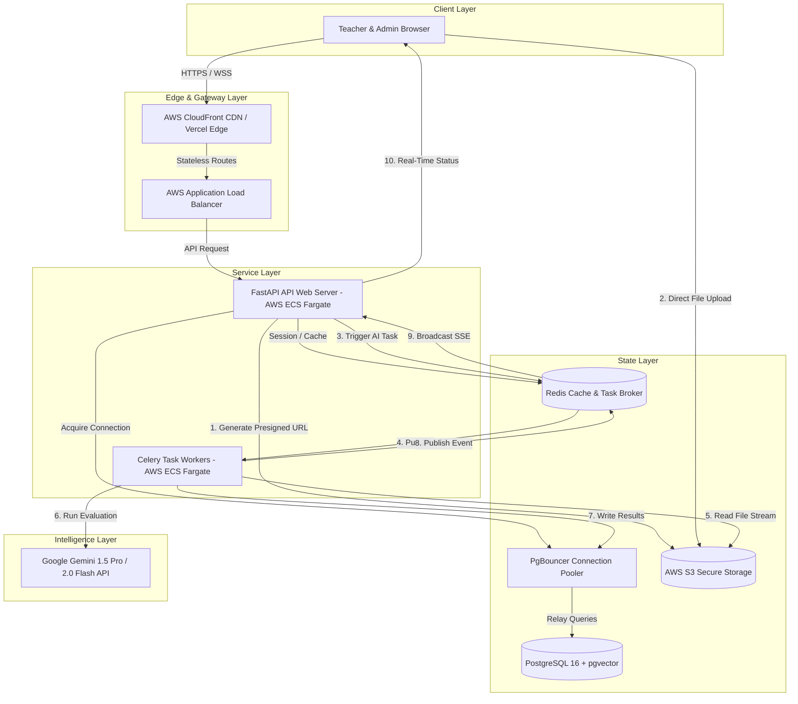
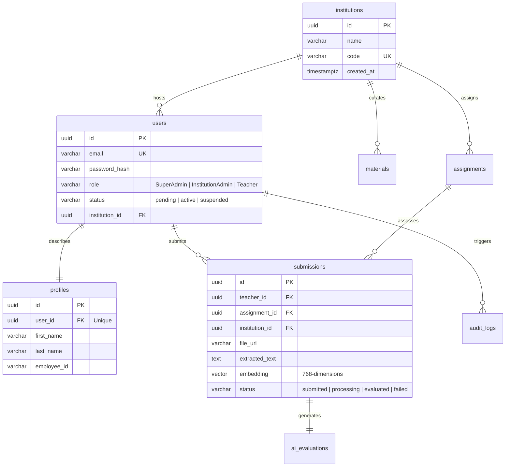
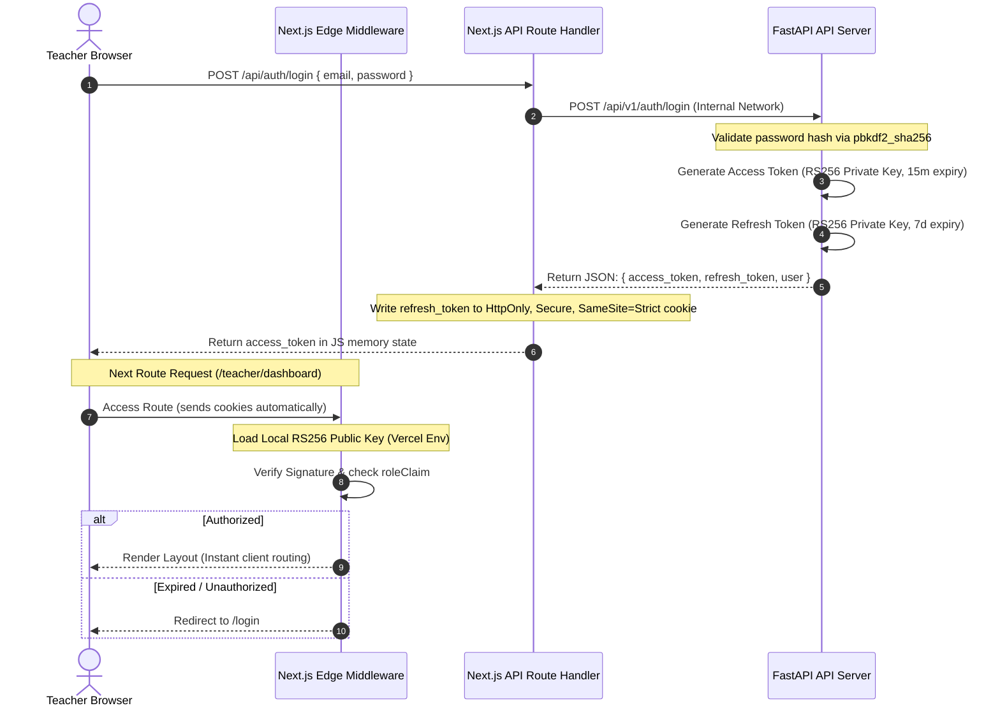
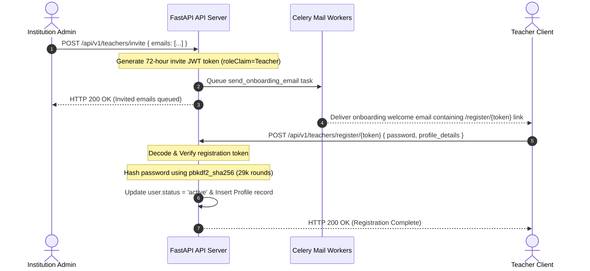
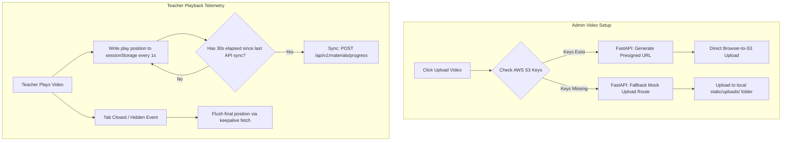

# EduSupervision — Master CTO Architecture & Implementation Journal

> **AI-Powered Teacher Training, Evaluation & Educational Supervision Platform**
> 
> *This document captures the low-level, diagrammatic technical systems design, async state machines, multi-tenant database patterns, and event-driven data flows of the EduSupervision platform from Phase 0 to Phase 5.*

---

## 🗺️ Master Platform Roadmap & Journal Directory

The documentation and journals for the platform's lifecycle are located as follows:

| Asset | Path | Description | Format |
|---|---|---|---|
| **Definitive Tech Stack Guide** | [`docs/FINAL_TECH_STACK.md`](file:///c:/Users/Devansh/Desktop/Projects/EduSupervision/docs/FINAL_TECH_STACK.md) | Complete resolved architectural specifications and exact configurations. | Markdown |
| **Phased Development Journal** | [`docs/EduSupervision_CTO_Journal.md`](file:///c:/Users/Devansh/Desktop/Projects/EduSupervision/docs/EduSupervision_CTO_Journal.md) | **(This File)** Low-level diagrams, workflows, and logical state machines for all phases. | Markdown (Mermaid) |
| **Print-Ready Phase 0 Specs** | [`docs/EduSupervision_Phase0_Journal.docx`](file:///c:/Users/Devansh/Desktop/Projects/EduSupervision/docs/EduSupervision_Phase0_Journal.docx) | System architecture blueprint and planning summaries for stakeholders. | MS Word (`.docx`) |
| **Print-Ready CTO Journal** | [`docs/EduSupervision_CTO_Journal.docx`](file:///c:/Users/Devansh/Desktop/Projects/EduSupervision/docs/EduSupervision_CTO_Journal.docx) | Fully styled Word document containing comprehensive code models and blueprints. | MS Word (`.docx`) |

---

## 1. System Topology & Data Flow (Phase 0)

EduSupervision is architected as an asynchronous, event-driven web application. The design separates frontend presentation, stateless API coordination, long-running heavy AI task execution, and sub-second caching.

### 🔌 Component Communication Topology



---

## 2. Technical Deliberations & Resolved Conflicts (Phase 0.5)

During the architecture review stage, the engineering team resolved major trade-offs in three core domains: database search, security latency, and traffic loads.

### 2.1 Plagiarism Vector Search: HNSW vs. IVFFlat
*   **The Conflict:** The database architect proposed `IVFFlat` for its small memory footprint, while the AI engineer pushed for `HNSW` (Hierarchical Navigable Small World).
*   **The Resolution:** We committed to **HNSW**. While `IVFFlat` consumes less memory, it silently degrades in search accuracy (`recall@10` drops to `~0.90`) as the corpus grows unless constant manual `REINDEX` operations are scheduled. `HNSW` achieves `0.98+` recall natively, handles incremental updates gracefully without accuracy loss, and consumes only `~25MB` of memory for a 100K-vector corpus.

### 2.2 Security: Edge JWKS Fetch vs. Embedded RS256 Env Public Keys
*   **The Conflict:** Verifying access tokens in the Next.js Edge Middleware requires validating the signature. Fetching public keys via a remote JWKS (JSON Web Key Set) endpoint adds network latency.
*   **The Resolution:** The **RS256 Public Key is embedded as an environment variable in Next.js**. This eliminates remote network roundtrips entirely, ensuring sub-5ms route security decisions at the Edge.

### 2.3 Traffic: Throttling Video Progress Tracking
*   **The Conflict:** Tracking video telemetry every 10 seconds would generate 50 requests per second for 500 concurrent teachers, risking database resource exhaustion.
*   **The Resolution:** Implement a **30-second throttled buffer with Keepalive fallback**:
    1. Played timestamps write immediately to client `sessionStorage`.
    2. API syncs occur only once every **30 seconds** during active playback.
    3. If the tab closes or is hidden, a final telemetry payload is flushed instantly via browser `navigator.sendBeacon` or a `fetch(..., { keepalive: true })` call.

---

## 3. Database Architecture & pgvector Modeling (Phase 1)

EduSupervision implements a robust multi-tenant schema where all operational data is partitioned at the query layer via `institution_id` scopes.

### 🗄️ Database Entity Relationship Map



### ⚡ Indexing Strategy for Performance Isolation
To maintain instant search metrics, database performance is secured with these index rules:
1.  **Multi-Tenant Isolation Routing:** Indexes are created on `(institution_id, user_id)` compound columns.
2.  **Semantic Plagiarism Search Index:**
    ```sql
    CREATE INDEX CONCURRENTLY ON submissions
        USING hnsw (embedding vector_cosine_ops)
        WITH (m = 16, ef_construction = 64);
    ```
3.  **Audit Logs Indexes:** Compound index on `(user_id, created_at DESC)` ensures historical checks do not trigger sequential table scans.

---

## 4. Stateless RS256 Authentication & RBAC (Phase 2)

We implement a highly secure, stateless authentication flow designed to be completely immune to common Cross-Site Scripting (XSS) and Cross-Site Request Forgery (CSRF) vulnerabilities.

### 🔑 Security Protocol Architecture



### 🛡️ Core Security Controls
*   **No localStorage Storage:** Access tokens are kept in client-side runtime memory (variables) and are destroyed on page refresh. Refresh tokens live inside secure, HTTP-only cookie structures.
*   **Asymmetric Key Separation:** Public keys only verify tokens, allowing edge middleware to operate without storing private signing keys.
*   **Tenant Scoping:** The `institution_id` claim is automatically extracted from JWT payloads in FastAPI, injecting tenant constraints into database execution handlers.

---

## 5. Bulk Teacher Onboarding Pipeline (Phase 3)

The onboarding model allows administrators to invite hundreds of educators using automated background task coordination.

### 👥 Onboarding & Registration Event Loop



---

## 6. Training Distribution & Hybrid Video Telemetry (Phase 4)

EduSupervision supports high-bandwidth media delivery that runs both locally in offline developer mode and securely in the cloud.

### 🎥 Media Upload and Progress Buffering Design



---

## 7. Asynchronous AI Evaluation Engine (Phase 5)

The core engine handles teacher submission parsing, plagiarism indexing, multi-stage LLM evaluation, and real-time frontend updates.

### 🤖 Async AI Evaluation Lifecycle State Machine

```mermaid
stateDiagram-v2
    [*] --> Submitting : POST /api/v1/submissions
    Submitting --> S3_Uploading : File validated (MIME/Size)
    S3_Uploading --> Enqueued : Upload completed; Task sent to Redis broker
    S3_Uploading --> Error_Failed : S3 Network/IO exception
    
    state Enqueued {
        [*] --> Redis_Queue : Task ID registered
        Redis_Queue --> Worker_Assigned : Celery worker pulls job
    }

    Enqueued --> Document_Parsing : Status = 'processing'
    
    state Document_Parsing {
        [*] --> Check_MIME
        Check_MIME --> Native_PDF : application/pdf (Digital)
        Check_MIME --> Image_Fallback : image/* or Scanned PDF
        
        Native_PDF --> Extract_Text : Extract stream using PyMuPDF
        Image_Fallback --> Gemini_Vision_OCR : Multi-page Vision prompt
        
        Extract_Text --> Text_Sanitized : Clean whitespace & strip HTML
        Gemini_Vision_OCR --> Text_Sanitized : Extract and clean text layout
    }

    Document_Parsing --> Plagiarism_Matching : Check text length > threshold
    Document_Parsing --> Error_Failed : Empty text stream / Parsing crash

    state Plagiarism_Matching {
        [*] --> Generate_Embedding : Request text-embedding-004
        Generate_Embedding --> Vector_Query : Execute pgvector cosine similarity lookup
        Vector_Query --> Similarity_Verdict : Match score >= 0.85?
        Similarity_Verdict --> Isolate_Match : Flag submission & reference ID
        Similarity_Verdict --> Clear : No close match found
    }

    Plagiarism_Matching --> Rubric_Evaluation
    
    state Rubric_Evaluation {
        [*] --> Construct_Structured_Prompt : Inject Rubric JSON Schema + Submission Text
        Construct_Structured_Prompt --> Call_Gemini_Pro : Invoke API (Temp = 0.2)
        Call_Gemini_Pro --> Parse_Pydantic : Validate structured JSON response
        
        Parse_Pydantic --> Evaluation_Complete : Validation Success
        Parse_Pydantic --> Call_Gemini_Retry : JSON Validation Failure (Refine Prompt)
        Call_Gemini_Retry --> Parse_Pydantic : Retry 2 (Temp = 0.0)
    }

    Rubric_Evaluation --> DB_Write : Status = 'evaluated'
    Rubric_Evaluation --> Error_Failed : Retries exhausted / API timeout

    state DB_Write {
        [*] --> Write_Metrics : Save scores, feedback, and recommendations
        Write_Metrics --> Broadcast_SSE : Trigger WebSocket/SSE notification
    }

    DB_Write --> [*]
    Error_Failed --> [*] : Mark record status = 'failed' & Log Error to Sentry
```



### 🛡️ Evaluation Engine Safeguards
1.  **Strict JSON Output Scheme:** We configure `responseMimeType="application/json"` with exact schema parameters, forcing Gemini to return a structured JSON evaluation matching our domain models.
2.  **Deterministic Evaluation Retries:** In the rare event of a schema mismatch, the fallback handler retries with the larger `Gemini 1.5 Pro` model at `temperature=0.0` (fully deterministic).
3.  **Semantic Plagiarism Flagging:** We calculate similarity strictly within matching assignments of the same institution. If `similarity_score >= 0.85`, the evaluation is flagged for human administrative review.
