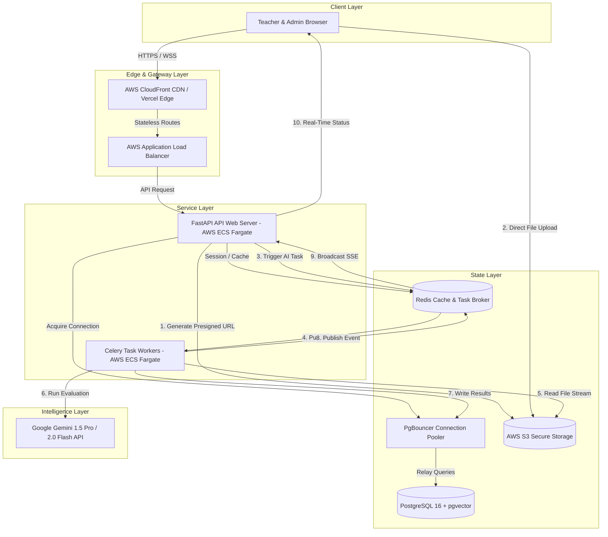
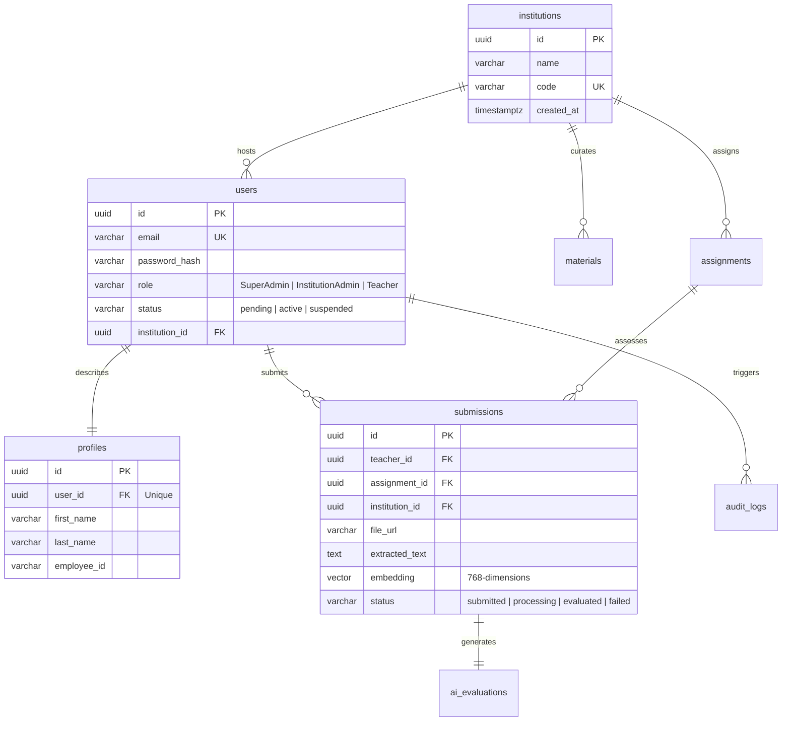
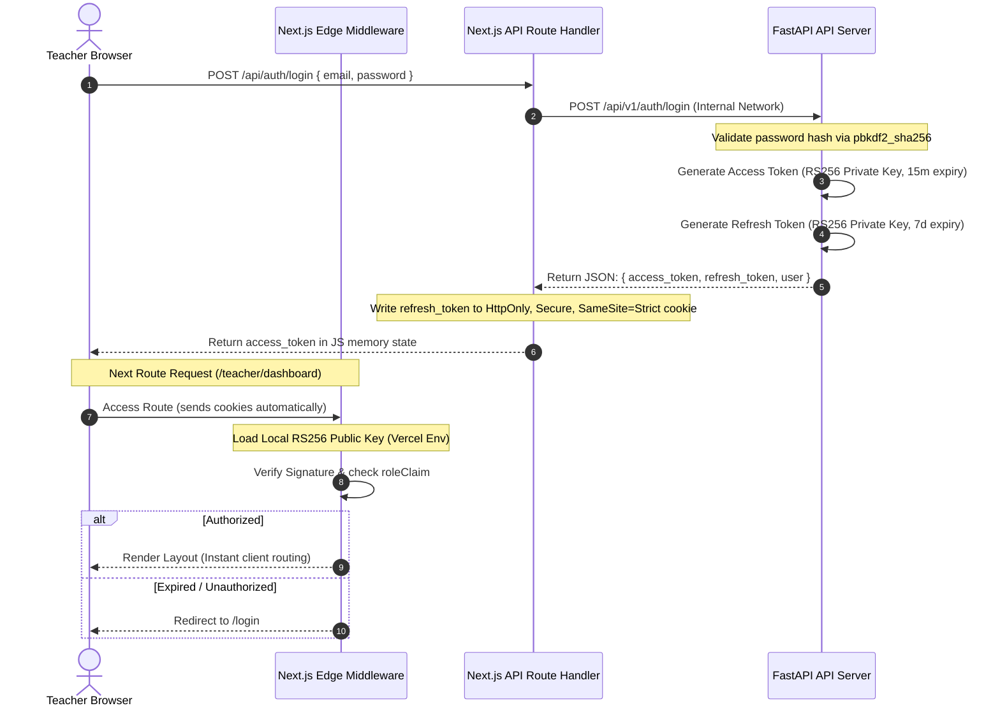
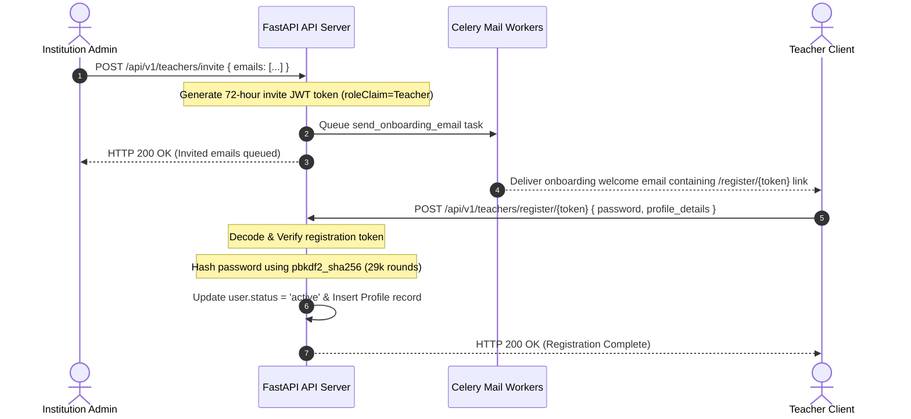
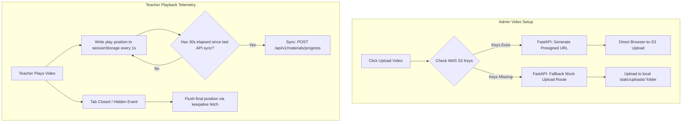
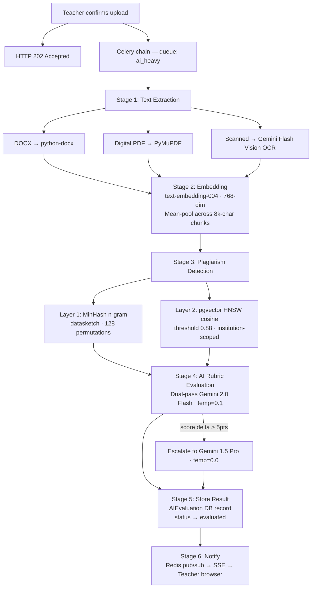

# EduSupervision — Master CTO Architecture & Implementation Journal

> **AI-Powered Teacher Training, Evaluation & Educational Supervision Platform**
> 
> *This document captures the low-level, diagrammatic technical systems design, async state machines, multi-tenant database patterns, and event-driven data flows of the EduSupervision platform from Phase 0 to Phase 5.*

---

## 🗺️ Master Platform Roadmap & Journal Directory

The documentation and journals for the platform's lifecycle are located as follows:

| Asset | Path | Description | Format |
|---|---|---|---|
| **Definitive Tech Stack Guide** | [`docs/FINAL_TECH_STACK.md`](file:///c:/Users/Devansh/Desktop/Projects/EduSupervision/docs/FINAL_TECH_STACK.md) | Complete resolved architectural specifications and exact configurations. | Markdown |
| **Phased Development Journal** | [`docs/EduSupervision_CTO_Journal.md`](file:///c:/Users/Devansh/Desktop/Projects/EduSupervision/docs/EduSupervision_CTO_Journal.md) | **(This File)** Low-level diagrams, workflows, and logical state machines for all phases. | Markdown (Mermaid) |
| **Print-Ready Phase 0 Specs** | [`docs/EduSupervision_Phase0_Journal.docx`](file:///c:/Users/Devansh/Desktop/Projects/EduSupervision/docs/EduSupervision_Phase0_Journal.docx) | System architecture blueprint and planning summaries for stakeholders. | MS Word (`.docx`) |
| **Print-Ready CTO Journal** | [`docs/EduSupervision_CTO_Journal.docx`](file:///c:/Users/Devansh/Desktop/Projects/EduSupervision/docs/EduSupervision_CTO_Journal.docx) | Fully styled Word document containing comprehensive code models and blueprints. | MS Word (`.docx`) |

---

## 1. System Topology & Data Flow (Phase 0)

EduSupervision is architected as an asynchronous, event-driven web application. The design separates frontend presentation, stateless API coordination, long-running heavy AI task execution, and sub-second caching.

### 🔌 Component Communication Topology



---

## 2. Technical Deliberations & Resolved Conflicts (Phase 0.5)

During the architecture review stage, the engineering team resolved major trade-offs in three core domains: database search, security latency, and traffic loads.

### 2.1 Plagiarism Vector Search: HNSW vs. IVFFlat
*   **The Conflict:** The database architect proposed `IVFFlat` for its small memory footprint, while the AI engineer pushed for `HNSW` (Hierarchical Navigable Small World).
*   **The Resolution:** We committed to **HNSW**. While `IVFFlat` consumes less memory, it silently degrades in search accuracy (`recall@10` drops to `~0.90`) as the corpus grows unless constant manual `REINDEX` operations are scheduled. `HNSW` achieves `0.98+` recall natively, handles incremental updates gracefully without accuracy loss, and consumes only `~25MB` of memory for a 100K-vector corpus.

### 2.2 Security: Edge JWKS Fetch vs. Embedded RS256 Env Public Keys
*   **The Conflict:** Verifying access tokens in the Next.js Edge Middleware requires validating the signature. Fetching public keys via a remote JWKS (JSON Web Key Set) endpoint adds network latency.
*   **The Resolution:** The **RS256 Public Key is embedded as an environment variable in Next.js**. This eliminates remote network roundtrips entirely, ensuring sub-5ms route security decisions at the Edge.

### 2.3 Traffic: Throttling Video Progress Tracking
*   **The Conflict:** Tracking video telemetry every 10 seconds would generate 50 requests per second for 500 concurrent teachers, risking database resource exhaustion.
*   **The Resolution:** Implement a **30-second throttled buffer with Keepalive fallback**:
    1. Played timestamps write immediately to client `sessionStorage`.
    2. API syncs occur only once every **30 seconds** during active playback.
    3. If the tab closes or is hidden, a final telemetry payload is flushed instantly via browser `navigator.sendBeacon` or a `fetch(..., { keepalive: true })` call.

---

## 3. Database Architecture & pgvector Modeling (Phase 1)

EduSupervision implements a robust multi-tenant schema where all operational data is partitioned at the query layer via `institution_id` scopes.

### 🗄️ Database Entity Relationship Map



### ⚡ Indexing Strategy for Performance Isolation
To maintain instant search metrics, database performance is secured with these index rules:
1.  **Multi-Tenant Isolation Routing:** Indexes are created on `(institution_id, user_id)` compound columns.
2.  **Semantic Plagiarism Search Index:**
    ```sql
    CREATE INDEX CONCURRENTLY ON submissions
        USING hnsw (embedding vector_cosine_ops)
        WITH (m = 16, ef_construction = 64);
    ```
3.  **Audit Logs Indexes:** Compound index on `(user_id, created_at DESC)` ensures historical checks do not trigger sequential table scans.

---

## 4. Stateless RS256 Authentication & RBAC (Phase 2)

We implement a highly secure, stateless authentication flow designed to be completely immune to common Cross-Site Scripting (XSS) and Cross-Site Request Forgery (CSRF) vulnerabilities.

### 🔑 Security Protocol Architecture



### 🛡️ Core Security Controls
*   **No localStorage Storage:** Access tokens are kept in client-side runtime memory (variables) and are destroyed on page refresh. Refresh tokens live inside secure, HTTP-only cookie structures.
*   **Asymmetric Key Separation:** Public keys only verify tokens, allowing edge middleware to operate without storing private signing keys.
*   **Tenant Scoping:** The `institution_id` claim is automatically extracted from JWT payloads in FastAPI, injecting tenant constraints into database execution handlers.

---

## 5. Bulk Teacher Onboarding Pipeline (Phase 3)

The onboarding model allows administrators to invite hundreds of educators using automated background task coordination.

### 👥 Onboarding & Registration Event Loop



---

## 6. Training Distribution & Hybrid Video Telemetry (Phase 4)

EduSupervision supports high-bandwidth media delivery that runs both locally in offline developer mode and securely in the cloud.

### 🎥 Media Upload and Progress Buffering Design



---

## 7. Asynchronous AI Evaluation Engine (Phase 5)

The core engine handles teacher submission parsing, plagiarism indexing, multi-stage LLM evaluation, and real-time frontend updates.

### 🤖 Async AI Evaluation Lifecycle State Machine

```mermaid
stateDiagram-v2
    [*] --> Submitting : POST /api/v1/submissions
    Submitting --> S3_Uploading : File validated (MIME/Size)
    S3_Uploading --> Enqueued : Upload completed; Task sent to Redis broker
    S3_Uploading --> Error_Failed : S3 Network/IO exception
    
    state Enqueued {
        [*] --> Redis_Queue : Task ID registered
        Redis_Queue --> Worker_Assigned : Celery worker pulls job
    }

    Enqueued --> Document_Parsing : Status = 'processing'
    
    state Document_Parsing {
        [*] --> Check_MIME
        Check_MIME --> Native_PDF : application/pdf (Digital)
        Check_MIME --> Image_Fallback : image/* or Scanned PDF
        
        Native_PDF --> Extract_Text : Extract stream using PyMuPDF
        Image_Fallback --> Gemini_Vision_OCR : Multi-page Vision prompt
        
        Extract_Text --> Text_Sanitized : Clean whitespace & strip HTML
        Gemini_Vision_OCR --> Text_Sanitized : Extract and clean text layout
    }

    Document_Parsing --> Plagiarism_Matching : Check text length > threshold
    Document_Parsing --> Error_Failed : Empty text stream / Parsing crash

    state Plagiarism_Matching {
        [*] --> Generate_Embedding : Request text-embedding-004
        Generate_Embedding --> Vector_Query : Execute pgvector cosine similarity lookup
        Vector_Query --> Similarity_Verdict : Match score >= 0.85?
        Similarity_Verdict --> Isolate_Match : Flag submission & reference ID
        Similarity_Verdict --> Clear : No close match found
    }

    Plagiarism_Matching --> Rubric_Evaluation
    
    state Rubric_Evaluation {
        [*] --> Construct_Structured_Prompt : Inject Rubric JSON Schema + Submission Text
        Construct_Structured_Prompt --> Call_Gemini_Pro : Invoke API (Temp = 0.2)
        Call_Gemini_Pro --> Parse_Pydantic : Validate structured JSON response
        
        Parse_Pydantic --> Evaluation_Complete : Validation Success
        Parse_Pydantic --> Call_Gemini_Retry : JSON Validation Failure (Refine Prompt)
        Call_Gemini_Retry --> Parse_Pydantic : Retry 2 (Temp = 0.0)
    }

    Rubric_Evaluation --> DB_Write : Status = 'evaluated'
    Rubric_Evaluation --> Error_Failed : Retries exhausted / API timeout

    state DB_Write {
        [*] --> Write_Metrics : Save scores, feedback, and recommendations
        Write_Metrics --> Broadcast_SSE : Trigger WebSocket/SSE notification
    }

    DB_Write --> [*]
    Error_Failed --> [*] : Mark record status = 'failed' & Log Error to Sentry
```



### 🛡️ Evaluation Engine Safeguards
1.  **Strict JSON Output Scheme:** We configure `responseMimeType="application/json"` with exact schema parameters, forcing Gemini to return a structured JSON evaluation matching our domain models.
2.  **Deterministic Evaluation Retries:** In the rare event of a schema mismatch, the fallback handler retries with the larger `Gemini 1.5 Pro` model at `temperature=0.0` (fully deterministic).
3.  **Semantic Plagiarism Flagging:** We calculate similarity strictly within matching assignments of the same institution. If `similarity_score >= 0.85`, the evaluation is flagged for human administrative review.

---

## 8. Phase 5: Redesign & "The Academic Registry" System Design

To accommodate the professional demands of a mature educator workforce and the high standards of Ministry of Education supervisors (government auditors), Phase 5 implements a visual pivot from a creative studio aesthetic into **"The Academic Registry"**—an authoritative design system inspired by traditional university archives, diplomatic documents, and state credentials.

### 8.1 Color System Calibration (Dignified & Highly Readable)

We overhaled the theme variables in the globals stylesheet to establish visual gravity and scholastic pedigree:

*   **Background (Scholastic Ink):** Mapped to `#070a10` (Deep slate-navy black), conveying absolute systemic stability and institutional security.
*   **Primary Accent (Royal Burgundy):** Mapped to `#991b1b` (Burgundy/Crimson), representing administrative authority, official certification, and scholarly history.
*   **Secondary Accent (Brushed Brass):** Mapped to `#dfc397` (Champagne Brass) for high-impact typography numbers and active markers.
*   **Base Text (Warm Parchment):** Mapped to `#f5f2eb` (Chalky parchment white) to soften screen glare and mimic physical printed paper.

### 8.2 Chronological Transition Tuning (Monumental & Steady)

To maintain structural dignity, the animation curves were tuned to be deliberate and architectural:

*   **Monumental Entry Reveals (`slate-reveal`):** Slowed to **1.3 seconds** with high-damping Bezier keyframes (`cubic-bezier(0.16, 1, 0.3, 1)`), making dashboard modules slide into place with architectural weight.
*   **Scholastic Glow (`drift-organic`):** Slowed background gradient drifting to a **45-second cycle**, creating a highly stable, breathing environment that eliminates reading distractions.
*   **Diplomatic Beacons (`pulse-ring`):** Glowing active indicators are set to an elongated **8-second breathing loop**.

### 8.3 Asymmetrical Layout Archetypes

We overhaled the route layouts to represent data high-density and editorial layouts:

```
[The Asymmetrical Roster Grid]
┌───────────────────────────────────────────────┬──────────────────────────────┐
│  Primary Ledger & Submissions Dossiers        │  Supervision Actions Panel   │
│  - Hairline sand-gold borders (1px)           │  - 72h Invite Key trigger    │
│  - Extreme Typography Stats (text-5xl)        │  - PDF Ingestion hooks       │
│                                               │  - State Seal Indicators     │
│  [col-span-8]                                 │  [col-span-4]                │
└───────────────────────────────────────────────┴──────────────────────────────┘
```

1.  **Landing Page Monolith:** Features an off-axis rotating monolith representing the **State Credentials Ledger** with nested gold rotating rings, glass structural frames, and deep slate-navy backgrounds.
2.  **Horizontal Learning Pathways:** Replaced standard grids with asymmetrical, progress-tracked certification tracks mapping Stage 1 of 4 certification milestones (Foundation → Practice → Advanced → Expert).

---

## 9. Phase 6: AI Evaluation Engine — Submissions, Plagiarism & Rubric Scoring

Phase 6 brings the platform's core intelligence online. Teachers upload professional development submissions, and a 6-stage Celery pipeline evaluates each one automatically — extracting text, generating semantic embeddings, running plagiarism detection, and producing a detailed AI rubric score using Google Gemini. Results appear on the teacher's screen in real-time through Redis pub/sub and SSE.

### 9.1 New API Surface

| Module | Purpose |
|---|---|
| `backend/app/api/v1/assignments.py` | CRUD for rubric-graded assignments (Admin creates, Teachers list) |
| `backend/app/api/v1/submissions.py` | Presign → Upload → Confirm flow, submission list/detail with embedded evaluation |
| `backend/app/schemas/assignments.py` | Pydantic v2 schemas for assignment, submission, and evaluation data contracts |

Key design decisions:
- `POST /submissions/confirm` returns **HTTP 202** immediately — evaluation runs fully async
- Teachers cannot double-submit to the same assignment (idempotency guard on status field)
- Plagiarism flags are stored in `score_json` JSONB for lightweight admin queries
- All queries are scoped to `institution_id` — cross-institution comparison is architecturally impossible

### 9.2 6-Stage Evaluation Pipeline (Celery Chain)



### 9.3 Anti-Hallucination Safeguards

1. **Dual-pass consistency check:** Two independent Flash runs at `temperature=0.1`. Any criterion delta > 5 pts triggers escalation to `gemini-1.5-pro` at `temperature=0.0`.
2. **Evidence quote requirement:** Every rubric criterion score must include an `evidence_quote` — an exact verbatim quote from the submission text. The model literally cannot score what it cannot cite.
3. **Human-in-the-loop on plagiarism:** AI never makes a final plagiarism decision autonomously. All flags surface in the Admin Evaluations dashboard for human review.

### 9.4 Frontend Pages Added

| Page | Route | Role |
|---|---|---|
| Teacher Assignments (live API) | `/teacher/assignments` | Fetches real assignments, XHR file upload via presigned URL, triggers AI pipeline |
| Submission Result | `/teacher/assignments/[id]` | Animated score ring, criterion breakdown with evidence quotes, recommendations |
| Admin Evaluations | `/admin/evaluations` | Paginated institution-wide submission table, score meters, plagiarism flag indicators |

### 9.5 Development Mode Graceful Degradation

When `GEMINI_API_KEY` is absent, the pipeline degrades gracefully:

| Stage | Dev Behaviour |
|---|---|
| Text Extraction | Runs fully (PyMuPDF/python-docx work locally) |
| Embedding | Returns 768-dim zero vector mock |
| Plagiarism | MinHash runs; pgvector search may return empty if DB has no embeddings |
| AI Evaluation | Returns structured mock result with "configure GEMINI_API_KEY" message |
| Redis Notify | Silently skipped; teacher can poll `/submissions/{id}/status` as fallback |

---

## 10. Phase 7: Analytics & Performance Reporting

Phase 7 transforms raw evaluation data into institutional intelligence. Administrators get a live operations dashboard with score distributions, criterion gap analysis, and CPD stage tracking. Teachers get a personal progress view with a visual certification pathway and AI-sourced improvement recommendations.

### 10.1 Analytics API Endpoints

| Endpoint | Access | Purpose |
|---|---|---|
| `GET /analytics/institution` | Admin, SuperAdmin | Full institution dashboard: KPIs, score distribution, teacher summaries, assignment summaries |
| `GET /analytics/ministry` | SuperAdmin only | Cross-institution comparative view for Ministry supervisors |
| `GET /analytics/teacher/me` | Teacher | Personal score trend, CPD stage, criterion breakdown, training completion |
| `GET /analytics/teacher/{id}` | Admin, SuperAdmin | Admin view of any individual teacher's analytics |

### 10.2 CPD Certification Pathway Logic

```
Foundation   → avg_score < 70 OR total_evaluated < 2
Practice     → avg_score ≥ 70 AND total_evaluated ≥ 2
Advanced     → avg_score ≥ 80 AND total_evaluated ≥ 3
Expert       → avg_score ≥ 90 AND total_evaluated ≥ 5
```

The teacher's progression within their current stage (0–100%) is calculated by linear interpolation within the stage's score band. This drives the animated progress bar on the CPD pathway UI.

### 10.3 Score Distribution (PostgreSQL `width_bucket`)

The institution score distribution uses PostgreSQL's native `width_bucket()` function to bin scores into 10-point ranges directly in SQL — no Python post-processing required. This is faster and more scalable than loading all scores into memory.

```sql
SELECT width_bucket(ae.overall_score, 0, 100, 10) AS bucket, COUNT(*)
FROM ai_evaluations ae
JOIN submissions s ON ae.submission_id = s.id
WHERE s.institution_id = :inst_id
GROUP BY bucket ORDER BY bucket
```

### 10.4 Criterion Gap Analysis (JSONB `LATERAL` Join)

Criterion-level aggregation uses a PostgreSQL `LATERAL` join to unnest the `ai_evaluations.scores` JSONB array and compute `AVG()` per criterion — this avoids a separate `criteria` table and preserves the flexible rubric schema:

```sql
SELECT c->>'criterion', AVG(CAST(c->>'score_assigned' AS FLOAT))
FROM ai_evaluations ae
JOIN submissions s ON ae.submission_id = s.id,
LATERAL jsonb_array_elements(ae.scores) AS c
WHERE s.institution_id = :inst_id
GROUP BY criterion ORDER BY avg ASC LIMIT 5
```

### 10.5 Frontend Pages Added

| Page | Route | Highlights |
|---|---|---|
| Admin Analytics | `/admin/analytics` | KPI cards, score histogram, criterion gap chart, CPD distribution, teacher table with search, assignment table with completion rates |
| Teacher Progress | `/teacher/analytics` | Score trend SVG sparkline, animated CPD pathway with stage dots, criterion weakness chart, AI recommendations |

### 10.6 Ministry View Architecture

The `GET /analytics/ministry` endpoint is SuperAdmin-only and produces a cross-institution ranked league table — institutions sorted by average evaluation score. This is the view the Ministry of Education supervisor would use to audit comparative performance across school districts without exposing individual teacher data.

