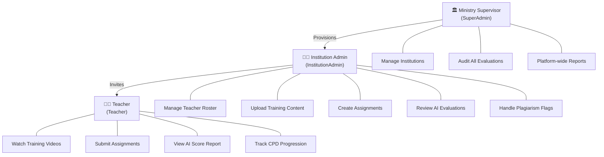
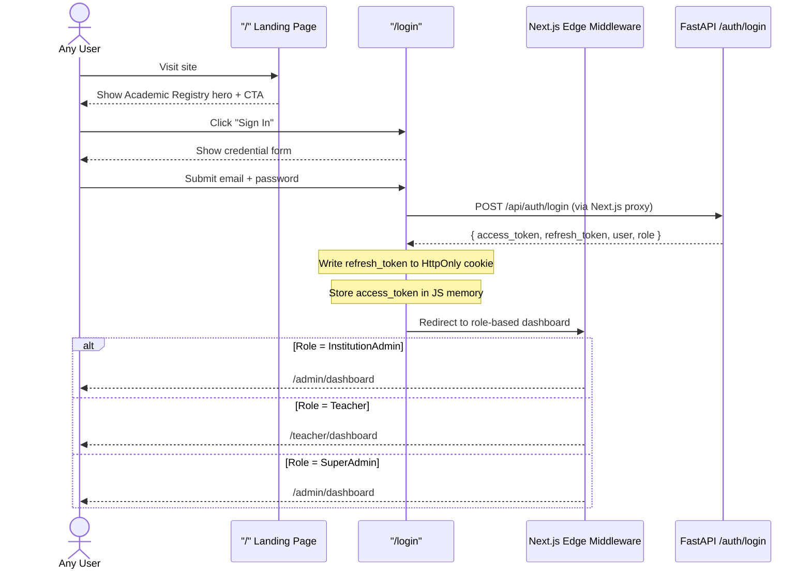
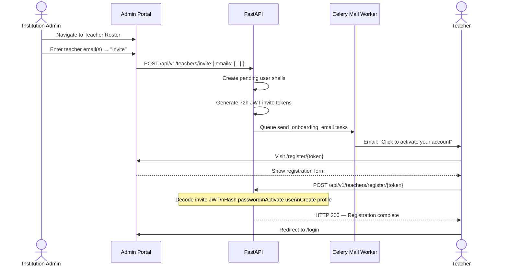
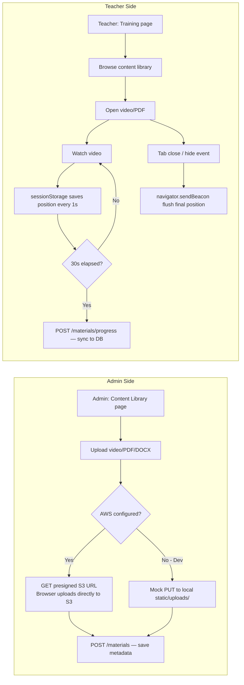
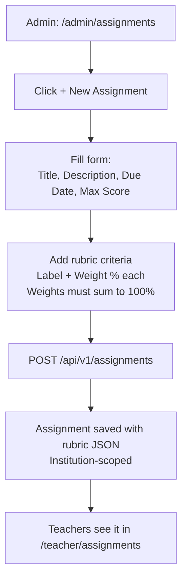
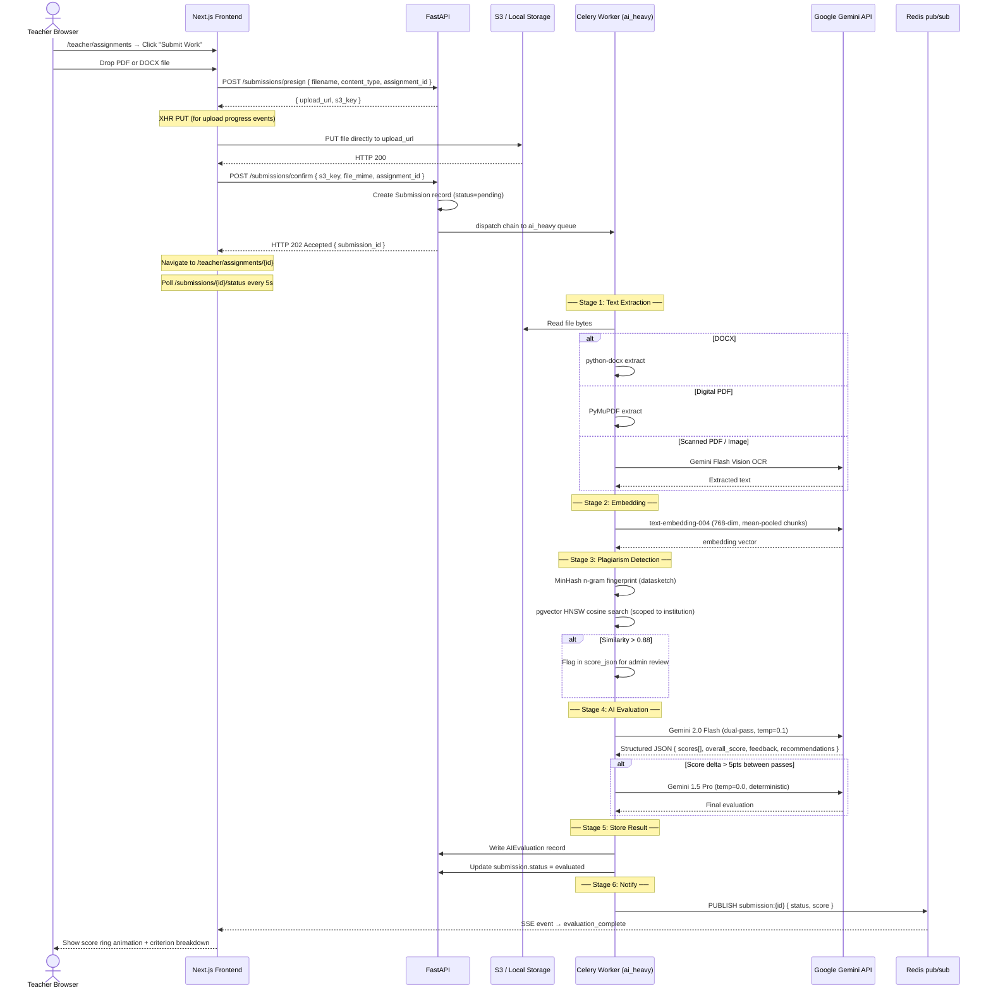
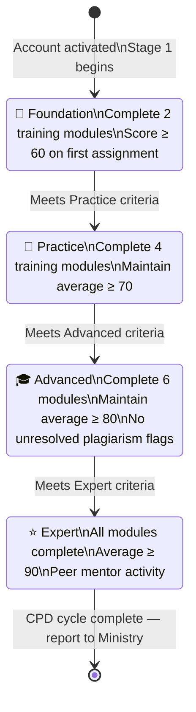
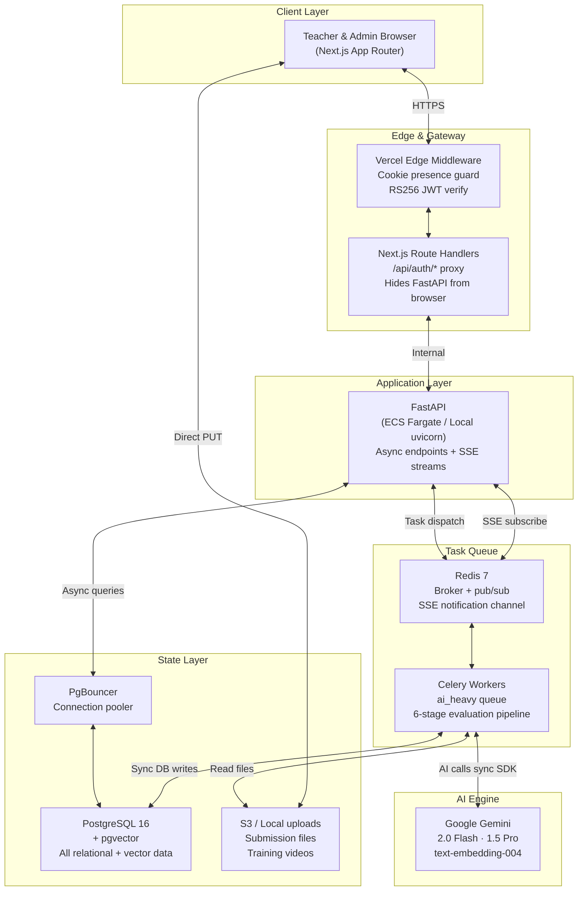

# EduSupervision — Finalized UX Flow Diagram
## All Three Roles · Every Major Interaction

---

## 1. Platform Roles & Access Map



---

## 2. Unauthenticated Landing → Login Flow



---

## 3. Institution Setup Flow (SuperAdmin)

```mermaid
flowchart TD
    SA[SuperAdmin logs in] --> SAD[/admin/dashboard]
    SAD --> Prov[POST /api/v1/institutions\nProvide: name, code, admin_email]
    Prov --> |Creates institution + admin user| Email[Celery sends admin credentials email]
    Email --> AdminLogin[Admin receives email\nLogs in with temp password]
    AdminLogin --> ChangePass[Admin changes password]
    ChangePass --> AdminReady[Institution Admin ready]
```

---

## 4. Teacher Onboarding Flow (Admin)



---

## 5. Training Content Flow (Admin → Teacher)



---

## 6. Assignment Creation Flow (Admin)



---

## 7. Teacher Submission & AI Evaluation Flow *(Core Feature)*



---

## 8. Admin Evaluation Review Flow (Plagiarism & Audit)

```mermaid
flowchart TD
    Admin[Admin: /admin/evaluations] --> Table[View paginated submission table\nAll institution submissions]
    Table --> Filter[Filter by status:\nAll / Evaluated / Processing / Pending / Failed]
    Table --> Row[Click Review → on any submission]
    Row --> Detail[/admin/evaluations/{id}\nFull evaluation detail]

    Detail --> Scores[Criterion scores + evidence quotes]
    Detail --> Feedback[AI feedback paragraph]
    Detail --> Recs[Professional development recommendations]
    Detail --> Flag{Plagiarism flag?}
    Flag -->|Yes| AdminReview[Admin reviews flagged submissions\nMakes final plagiarism determination]
    Flag -->|No| Pass[Evaluation complete — no action needed]

    AdminReview --> Decision{Admin decision}
    Decision -->|Not plagiarism| Clear[Clear flag — teacher notified]
    Decision -->|Confirmed plagiarism| Action[Take appropriate institutional action]
```

---

## 9. CPD Progression Pathway (Teacher)



---

## 10. Complete System Data Flow


